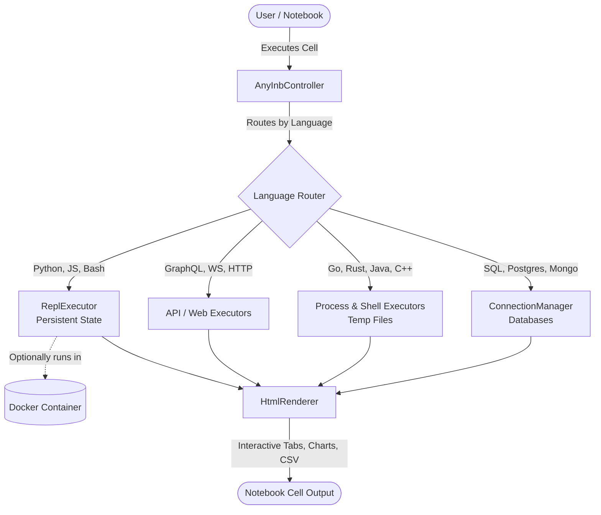

# AnyINB — The Ultimate Universal Notebook

AnyINB is a universal interactive notebook extension for VS Code that lets you write and execute code, database queries, API requests, and shell scripts all within a single `.anyinb` file.

**It has been updated with State-of-the-Art features.**

## 🌟 Ultimate Features

- **🔄 Persistent REPL Sessions**: Variables and functions defined in one Python, Node.js, or Bash cell carry over to the next! True Jupyter-like experience without the heavy kernel installations.
- **📊 Built-in Data Visualization**: Results from databases (SQL, PostgreSQL, SQLite, etc.) are rendered in tables, and with one click, you can visualize them as Bar Charts right inside the notebook!
- **⬇️ Export Data**: One click to export any tabular output to a local `.csv` or `.json` file.
- **🛑 Execution Controls**: Full support for native VS Code notebook controls. Click the Stop button to interrupt hanging scripts or cancel long-running database queries.
- **🐳 Docker Execution**: Enable `anyinb.useDocker` in your settings to execute Python, Node, or Bash scripts securely inside isolated Docker containers instead of your host machine!
- **🌐 GraphQL & WebSockets**: Dedicated executors for GraphQL APIs and WebSocket connections.
- **🔐 Environment Variables**: Automatically loads `.env` files from your workspace. Use `{{MY_API_KEY}}` seamlessly in HTTP, GraphQL, and WebSocket requests.
- **🗣️ Interactive Shells**: Supports code that requires user input (e.g., `input()` in Python or `read` in Bash) using native VS Code input boxes!

## Architecture

## Supported Languages and Runtimes

### 🧑‍💻 Programming Languages
- Python (`python`) **[Supports Persistent REPL]**
- JavaScript (`javascript` / `node`) **[Supports Persistent REPL]**
- TypeScript (`ts-node`)
- Go (`go run`)
- Rust (`cargo run` / `rustc`)
- Java (`java`)
- C & C++ (`gcc` / `g++`)
- ...and many more!

### 🗄️ Databases
- **MySQL / MariaDB** (`sql`)
- **PostgreSQL** (`postgres`)
- **SQLite** (`sqlite`)
- **MongoDB** (`javascript` / `mongodb` syntax)
- **Redis** (`redis`)

### 🐚 Shells & Scripts
- Bash / Shell Script (`bash` / `sh`) **[Supports Persistent REPL]**
- PowerShell (`powershell`)
- Batch (`cmd.exe`)

### 🌐 Web / API
- HTTP / REST (`http`)
- GraphQL (`graphql`)
- WebSockets (`websocket`)

## Getting Started

1. Create a new file with the `.anyinb` extension.
2. Add a new code cell.
3. Select the language you want to practice in the bottom right corner of the cell.
4. Write your code and press `Ctrl+Enter` or click the Play button to execute it.
5. If using a database, ensure you run the `AnyINB: Configure Database Connection` command first.

## Extension Settings

- `anyinb.useDocker`: Set to `true` to run compatible language cells (Python, Node, Bash) inside isolated Docker containers instead of the host machine.
