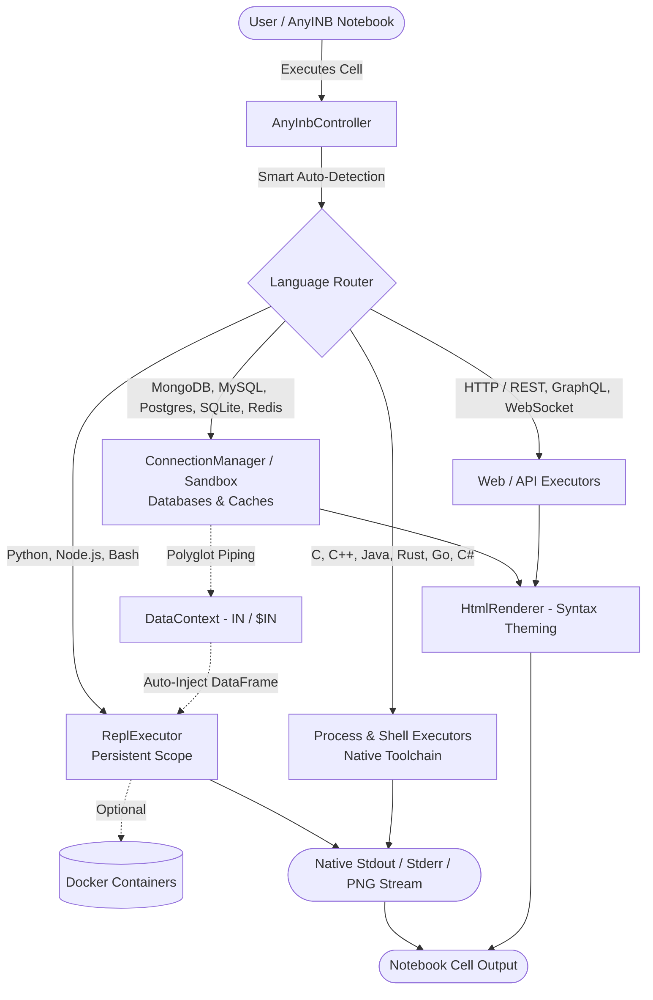

# 🚀 AnyINB — The Universal Polyglot Notebook for VS Code

**AnyINB** (`.anyinb`) is the direct multi-language successor to Jupyter (`.ipynb`). It combines the authentic Jupyter notebook experience (stateful REPLs, inline Matplotlib/Seaborn plots, monospace text streams, and `%pip` magics) with **true polyglot execution** across **15+ programming languages, databases, shells, and APIs** in the exact same notebook file.

---

## 🌟 Key Highlights

### 🎨 Pure `.ipynb` Native Aesthetics (Zero AI Slop)
- **100% Transparent Canvas**: Outputs sit directly on your editor canvas without artificial bounding boxes, nested dark cards, or cluttered borders.
- **Pure Syntax Theming**: Themes (*Terminal, Dracula, Monokai, Tokyo Night, Nord*) customize the **syntax highlight colors** of your query and JSON outputs without adding heavy backgrounds.
- **Native Inline Visualizations**: Matplotlib and Seaborn plots render directly as crisp, high-resolution inline PNGs with full zoom, copy, and save support.

### 🧬 Everything You Love from Jupyter `.ipynb`
- **Stateful REPL Variables**: Variables and imports declared in Cell 1 (`x = 10`, `df = ...`) stay alive in Cell 2 and Cell 3 (Python & Node.js).
- **Jupyter Magic Commands**: Install packages on the fly with `%pip install <package>` or `!pip install <package>`.
- **Interactive User Input**: Interactive `input()`, `cin >> n`, and `scanf()` prompts with seamless native input dialogs.
- **Non-Blocking Plotting**: Run `plt.show()` without desktop GUI freezes or 30-second timeouts.

### ⚡ Groundbreaking Polyglot Superpowers
- **🌉 Cross-Language Data Piping (`IN` / `$IN`)**: Query MongoDB or SQL in Cell 1 $\rightarrow$ Python in Cell 2 automatically has `IN` as a **Pandas DataFrame** $\rightarrow$ WSL/Bash in Cell 3 has `$IN_JSON`.
- **🪄 Smart Language Auto-Detection**: Pasted Java code into a C++ cell? AnyINB recognizes `public class ... System.out.println`, automatically flips the language tag to `Java`, and executes it with `javac` with zero errors.
- **🧪 Zero-Install Sandbox Mode**: Practice SQL (`CREATE TABLE`, `SELECT`) and MongoDB (`use ecommerce`, `db.users.find()`) in-memory with **0 database servers or Docker installed**.
- **🔀 Live Mock REST API Server**: Add `// @endpoint GET /api/users` above any JSON array to spawn an instant local micro-server for testing webhooks and frontend requests.
- **🎬 Interactive Presentation & Story Mode**: Step through your notebook with an interactive spotlight runner (`AnyINB: Start Presentation / Story Mode`).
- **🐳 Docker Isolation**: Enable `anyinb.useDocker` in settings to run Python, Node.js, or Bash scripts securely inside isolated Docker containers.

---

## 💻 Architecture

---

## 🛠️ Supported Languages & Runtimes

| Category | Supported Languages / Technologies | Key Capabilities |
| :--- | :--- | :--- |
| **Data & Scripting** | Python (`python`), JavaScript (`javascript`), TypeScript (`typescript`) | Persistent REPL, Inline Matplotlib/Seaborn plots, `%pip` magics, Polyglot `IN` DataFrame |
| **Compiled Languages** | C (`gcc`), C++ (`g++`), Java (`javac`), Rust (`cargo` / `rustc`), Go (`go run`), C# (`dotnet`) | Instant compilation, interactive `cin` / `scanf` input, smart auto-detection |
| **Databases & Caches** | MongoDB (`mongosh`), PostgreSQL, MySQL / MariaDB, SQLite, Redis | `show dbs`, `show collections`, `use <db>`, in-memory Sandbox fallback, syntax-highlighted documents |
| **Shells & OS** | Windows Command Prompt (`cmd`), PowerShell (`powershell`), Bash (`bash`), WSL (`wsl`) | Batch scripts, environment piping `$IN_JSON`, system diagnostics |
| **APIs & Web** | HTTP / REST (`http`), GraphQL (`graphql`), WebSockets (`websocket`) | `.env` variable interpolation (`{{API_KEY}}`), Live Mock Server (`@endpoint`) |

---

## 🚀 Getting Started

1. **Install AnyINB** from the VS Code Extensions Marketplace.
2. **Create a Notebook**: Create a new file ending in `.anyinb` (e.g. `analysis.anyinb`).
3. **Add Cells**: Click **`+ Code`** or **`+ Markdown`**.
4. **Run Code**: Write your code and press `Shift+Enter` or click the **Play (▶️)** button.
5. **Connect to Databases (Optional)**: Press `Ctrl+Shift+P` $\rightarrow$ **`AnyINB: Configure Database Connection`** to connect to live MongoDB, Postgres, MySQL, or Redis instances. *(If not connected, AnyINB will automatically run queries in Sandbox Mode!)*

---

## ⚙️ Configuration Settings

Customize AnyINB in VS Code Settings (`Ctrl+,` $\rightarrow$ search `AnyINB`):

| Setting | Default | Description |
| :--- | :--- | :--- |
| `anyinb.outputTheme` | `mongosh-terminal` | Theme for syntax-highlighted outputs (`mongosh-terminal`, `dracula`, `tokyo-night`, `monokai`, `one-dark`, `nord`, `github-dark`, `solarized-dark`). |
| `anyinb.maxOutputHeight` | `450` | Maximum height (in pixels) for long query/document outputs before scrolling. |
| `anyinb.pythonAutoPlot` | `true` | Automatically capture and render Matplotlib/Seaborn figures inline as PNGs. |
| `anyinb.useDocker` | `false` | Run Python, Node.js, and Bash cells inside isolated Docker containers. |
| `anyinb.useSandboxIfDisconnected` | `true` | Automatically fall back to built-in in-memory SQLite/MongoDB when no external database is connected. |

---

## 📄 License

MIT © [AnyINB Contributors](LICENSE)
